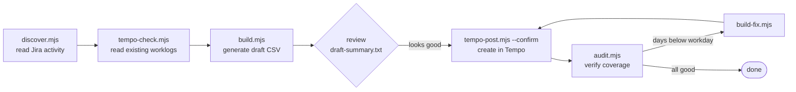

# tempo-report

> Backfill your **Jira → Tempo** worklogs without losing your mind.


`tempo-report` discovers which Jira issues you actually worked on, generates a
**reviewable draft** of worklogs that fills your workday, and creates them in
Tempo **without duplicating** anything already logged. Built for the moment you
realize you haven't filled Tempo in weeks (or months).

> **Safety first.** No script writes to Tempo by accident. Everything that
> creates or deletes is **dry-run by default** and only acts with `--confirm`.
> You always review a CSV before anything is sent.

---

## Table of contents

- [How it works](#how-it-works)
- [Requirements](#requirements)
- [Getting your API tokens](#getting-your-api-tokens)
- [Setup](#setup)
- [Usage](#usage)
- [Commands](#commands)
- [Recipes](#recipes)
- [Sample output](#sample-output)
- [How hours are decided](#how-hours-are-decided)
- [Locked periods](#locked-periods)
- [Claude Code commands](#claude-code-commands)
- [Privacy](#privacy)
- [Troubleshooting](#troubleshooting)
- [Project structure](#project-structure)
- [License](#license)

---

## How it works



The read steps (`discover`, `tempo-check`, `build`, `audit`) never touch Tempo.
Only `post`, `add` and `delete` write — and only with `--confirm`:

```
build.mjs ──► worklogs-draft.csv ──► post (dry-run)  ──► review ──► post --confirm
                                      └─ no network write ─┘        └─ writes ─┘
```

## Requirements

- **Node ≥ 20** — uses native `fetch`, **zero npm dependencies**.
- A Jira Cloud account with the **Tempo** app installed.
- A Jira API token and a Tempo API token (see below).

## Getting your API tokens

**Jira API token**

1. Sign in to Jira with the account that has access to the project.
2. Open **https://id.atlassian.net/manage-profile/security/api-tokens**
3. **Create API token** → give it a name (e.g. `tempo-report`) → set an expiry → **Create**.
4. Copy the token now — it is shown **only once**.
5. `JIRA_EMAIL` = that account's email · `JIRA_BASE_URL` = `https://your-company.atlassian.net`.

**Tempo API token**

1. In Jira, top nav → **Apps** → **Tempo**.
2. In the Tempo sidebar, open **Settings** (gear icon).
3. Go to **API integration** → **New Token**.
4. Name it, set an expiry, keep access scoped to **your own worklogs** → **Create**.
5. Copy the token (also shown only once).

## Setup

```bash
cp .env.example .env      # fill in your credentials
# edit config.json with your workday, holidays and Jira statuses
```

**`.env`**

| Variable | What it is |
|---|---|
| `JIRA_BASE_URL` | `https://your-company.atlassian.net` (no trailing slash) |
| `JIRA_EMAIL` | the email of your account on that Jira |
| `JIRA_API_TOKEN` | from the Jira step above |
| `TEMPO_API_TOKEN` | from the Tempo step above |
| `SINCE` | _(optional)_ start date `YYYY-MM-DD`; default = today − `rangeMonthsBack` |

**`config.json`** — adapt it to your company, no code changes needed:

| Key | Meaning |
|---|---|
| `rangeMonthsBack` | how many months back to look by default |
| `hoursPerDay` | target workday (e.g. `8`) |
| `workdayStart` / `lunchStart` / `lunchEnd` / `workdayEnd` | schedule; lunch is left free |
| `roundingMinutes` | time-split granularity (e.g. `15`) |
| `maxTasksPerDay` | max issues spread across one day |
| `activeDevStatuses` | Jira statuses that count as "working" |
| `holidays` | dates to skip (`YYYY-MM-DD`) |

One-off PTO/vacation: create `data/exclude-dates.txt`, one `YYYY-MM-DD` per line.

## Usage

```bash
npm run prep                                  # discover + check + build + audit (read-only)
# review data/draft-summary.txt and the audit
npm run post -- --month 2026-06               # DRY-RUN: what would be created
npm run post -- --month 2026-06 --confirm     # actually send
npm run check && npm run audit                # verify
npm run fix                                   # if any day ended below the workday
npm run post -- --file ./data/worklogs-fix.csv --confirm
```

Pass flags after `--`, e.g. `npm run post -- --month 2026-06 --confirm`.

## Commands

| `npm run …` | What it does | Writes to Tempo? |
|---|---|---|
| `discover` | Read Jira: identity, issues & history → `data/issues.json` | No |
| `check` | Read your existing Tempo worklogs → `data/tempo-existing.json` | No |
| `build` | Generate draft → `data/worklogs-draft.csv` + summary | No |
| `fix` | Top up days below the workday (collision-safe) | No |
| `audit` | Report empty / partial / over-workday days & weeks | No |
| `detail` | List individual worklogs for given days (with ids) | No |
| `add` | Ad-hoc manual entry ("on day X I worked N h on Y") | **Yes, with `--confirm`** |
| `post` | Create the CSV's worklogs in Tempo | **Yes, with `--confirm`** |
| `delete` | Delete worklogs by id (rollback / duplicates) | **Yes, with `--confirm`** |
| `prep` | `discover` + `check` + `build` + `audit` in one go | No |

## Recipes

**Report last month**
```bash
npm run prep
npm run post -- --month 2026-05            # dry-run, review
npm run post -- --month 2026-05 --confirm
```

**Backfill several months back**
```bash
SINCE=2025-01-01 npm run prep              # SINCE env overrides .env
npm run post -- --from 2025-01-01 --to 2025-06-30 --confirm
```

**A day ended below the workday (anti-duplicate collision)**
```bash
npm run check && npm run fix               # builds worklogs-fix.csv
npm run post -- --file ./data/worklogs-fix.csv          # dry-run
npm run post -- --file ./data/worklogs-fix.csv --confirm
```

**Log a weekend / overtime day manually**
```bash
npm run add -- --entry "2026-05-16|ABC-123|4|13:00"           # dry-run
npm run add -- --entry "2026-05-16|ABC-123|4|13:00" --confirm
```

**Find & remove accidental duplicates**
```bash
npm run check && npm run audit                         # spot days over the workday
npm run detail -- --dates 2026-03-13                   # inspect, note the ids
npm run delete -- --ids 41244,41245                    # dry-run
npm run delete -- --ids 41244,41245 --confirm
npm run check && npm run fix                           # re-top-up if needed
```

## Sample output

`audit` (read-only health check):

```
Month    LV  =8h  <8h  =0h  >8h   hours
2026-04   22   22    0    0    0    176
2026-05   12    9    0    3    0     72

EMPTY DAYS (0h, weekdays): 3
  2026-05-04  2026-05-05  2026-05-06
```

`build` → `data/worklogs-draft.csv` (you review/edit this before sending):

```csv
date,weekday,issueKey,issueId,summary,hours,startTime,source,existingHours
2026-05-04,Mon,ABC-123,40001,Checkout payment retry,4.00,08:00:00,activity,0.00
2026-05-04,Mon,ABC-145,40020,Order export billing address,4.00,13:00:00,activity,0.00
2026-05-05,Tue,ABC-150,40044,Inventory import productId,8.00,08:00:00,week,0.00
```

`post --confirm` final report:

```
Created: 23   Skipped (already logged that day+issue): 2
Rejected (locked period): 0   Other errors: 0
```

## How hours are decided

1. For every weekday (Mon–Fri, minus holidays) **below** the target workday,
   compute the missing time.
2. Spread it across the issues with **your activity that day** (Jira changelog
   entries signed by you). If there's no signal that day, fall back to issues
   active **that week**.
3. Pack the time into the `config.json` schedule, keeping lunch free.
4. **Anti-duplicate:** never creates two worklogs for the same date+issue, so
   re-running is safe — it only adds what's missing.

The draft is a plain CSV. Edit it freely before `post`.

## Locked periods

If Tempo replies `403 "El estado de la planilla de horas debe estar abierto
para el período"`, that month's **timesheet is approved/closed** and the API
can't write there. `post` reports it as _rejected (locked)_ and continues. To
load it, ask your manager/admin to **reopen that period**, then re-run.

## Claude Code commands

If you use [Claude Code](https://claude.com/claude-code), the repo ships slash
commands in `.claude/commands/`:

- `/tempo-report [month]` — full guided flow (dry-run + confirmation).
- `/tempo-audit` — gap audit (read-only).
- `/tempo-add ...` — manual entry in natural language.

`CLAUDE.md` holds the operating context the agent follows.

## Privacy

`.env` and `data/` are git-ignored — credentials and your Jira/Tempo data are
**never** committed. The repo ships only code and example configuration.

## Troubleshooting

| Symptom | Cause / fix |
|---|---|
| `Faltan variables en .env` | Copy `.env.example` and fill it in. |
| `HTTP 401` from Jira | Check `JIRA_EMAIL` / `JIRA_API_TOKEN`. |
| `HTTP 404` from Jira | Check `JIRA_BASE_URL` (no trailing `/`). |
| `403 … planilla … abierto` | Locked period — ask for it to be reopened. |
| `Horas trabajadas debe ser mayor que 0` | Harmless: a 0h row from fine-grained splitting; sibling rows with time still post. |
| A day is below the workday after `post` | Anti-duplicate collision — run `npm run fix`. |

## Project structure

```
.
├── *.mjs              # pipeline scripts (one job each)
├── lib.mjs            # shared helpers: config, auth, paging
├── config.json        # your tunables (no code changes needed)
├── .env.example       # credential template (copy to .env)
├── .claude/commands/  # Claude Code slash commands
├── data/              # local Jira/Tempo data (git-ignored)
└── CLAUDE.md          # operating context for the agent
```

## License

MIT.
